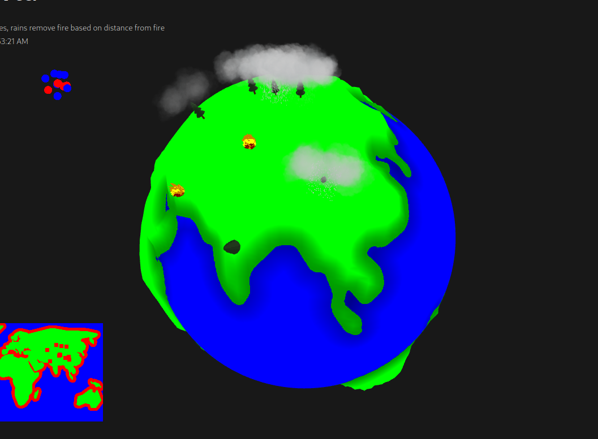

# :globe_with_meridians: Mini-World

**Mini World** is a 3D interactive game built with **React** and **Three.js**. In this game, players can create **rains** and **fires** to interact dynamically with a procedurally generated world.  

 
# Main Elements
The SandBox world has three elements:
- Fire
- Rain
- Tree
